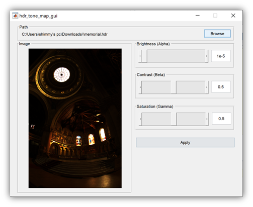
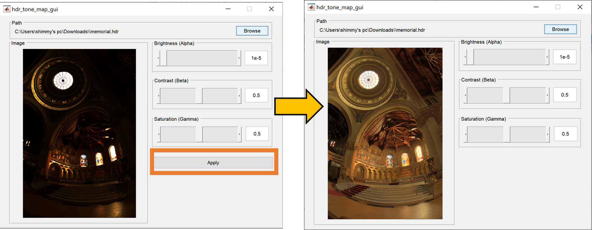
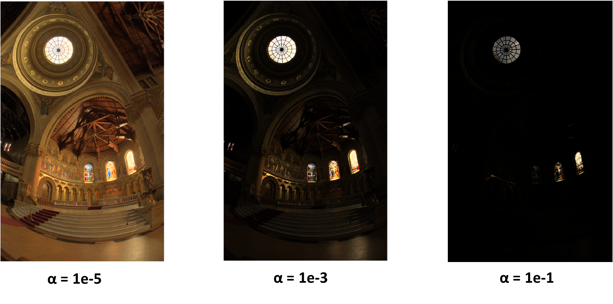
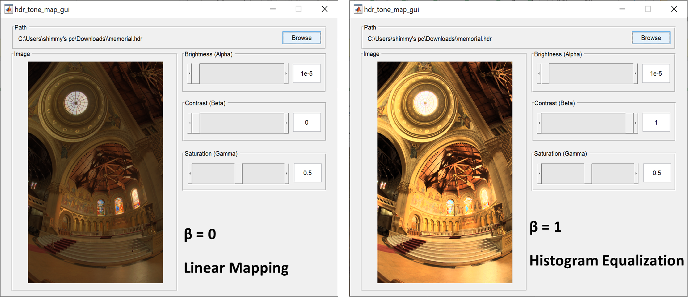
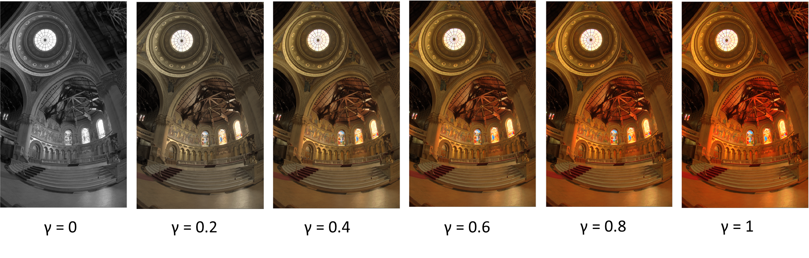

# HDR mapping

This project implements an operator and GUI for mapping high dynamic range
images, using Matlab, proposed in the paper "A Visibility Matching Tone Reproduction
Operator for High Dynamic Range Scenes" by Gregory Ward Larson, Holly Rushmeier, and Christine Piatko. 

For more information regarding the theoretical background of the implementation please refer to the PDF hdr_mapping.pdf

The mapping function:

```bash
Iout = hdr_fast_tone_mapping(hdrImg,alpha,beta,gamma,nbins)
```
This function receives as input:

1)  **hdrImg** -- a HDR format image for mapping

2)  **alpha** -- float, a parameter for adjusting the overall brightness
    of the reproduced image in accordance with eq.2 and eq.3

3)  **beta** -- float, range 0-1, a parameter controlling the mapping
    ration between linear scaling and histogram equalizion. In
    accordance with eq. 4

4)  **gamma** - float, range 0-1, a parameter for adjusting the overall
    saturation of the reproduced image. In accordance with eq. 5

5)  **nbins** -- integer, a parameter which set the number of
    quantization levels of the luminance. Higher values will result in
    higher luminance resolution at the expanse of computation
    complexity.

And returns **Iout,** the mapped input image using the proposed
operator, as output.

Since the mapping of high dynamic range images is highly subjective
process and to fully understand how each of the parameters -- alpha,
beta and gamma affect the output image, we designed a simple GUI which
allows quick and easy change of the parameters and the display of the
mapped image.

To use the GUI just run the function hdr_tone_map_gui:



The browse button lets the user load the input image (.hdr). The user
can change the parameters -- alpha, beta and gamma using either the
sliders or the text box next to it. Once an image was loaded, or there
was a change in configuration, the apply button will appear. Clicking
the apply button will map the input image according the proposed
operator:



**Alpha (Brightness):**



As can be seen above, lower values of alpha result in more dynamic range
allocated to dark parts of the image. This is also with accordance with
the global luminance-mapping curve.



As can be seen above, setting beta to 1 result in a histogram equalized
image while setting it to 0 results in linearly scaled image. Any value
between 0-1 will balance between contrast and level of detail as the
histogram equalization introduces contrast at the expanse of details
while linear scaling preserves more details.

**Saturation (Gamma):**



As can be seen above, higher values of gamma result in more saturated
color. Setting gamma to zero results in the loss of vibrance and color.
